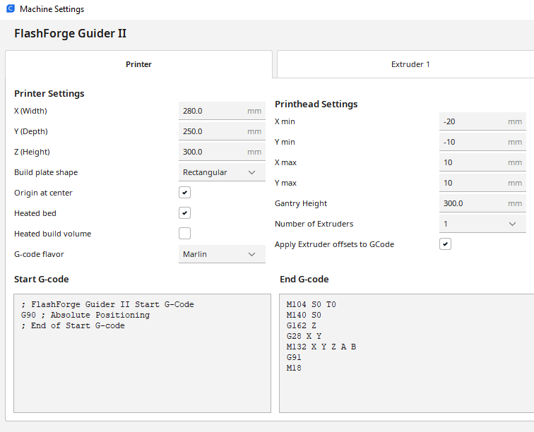
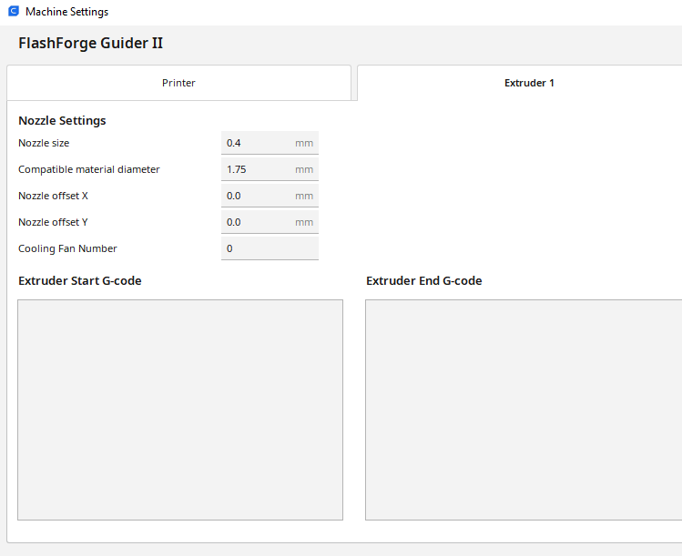

# Flashforge_Guider_II_Cura_Profile
Cura profile settings for the Flashforge Guider II. This is not official, just what I found works best.

Cura doesn't have an easy way to export/import custom printers, so here's some pictures of the settings. 
A txt doc will also be included for copy-paste. Additionally, the Guider II will work with G-code so you don't need their custom format.

